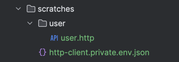
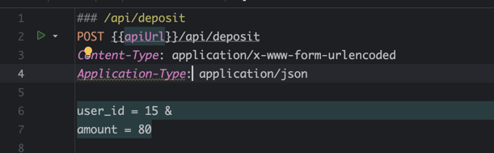

<h3>Laravel Sail</h3>

Запускаем установка пакетов  
composer install

Запуск сборки проекта  
<strong>./vendor/bin/sail up  </strong>

После сборки Docker нужно запустить миграцию  
<strong>./vendor/bin/sail artisan migrate   </strong>

После миграции нужно запустить сидеры 
<strong>./vendor/bin/sail artisan db:seed   </strong>

Если все успешно прошло то система готова к работе

Все тесты можно произвести в файле user.http

Пример пополнее депозита

